# 风暴潮与海浪智能预报助手（Agent）说明

> 一句话：把课题三/课题五的预报数据接进一个能"对话"的助手，用户用中文提问，助手自动到课程数据库（FTP）按需取数、判级、出图，并把结论整理成业务简报。
> 代码地址：<https://github.com/jdhalaxi-123/agent-storms-urge-and-wave>

---

## 一、它能做什么

| 能力 | 说明 | 例子 |
| --- | --- | --- |
| 站点预报 | 厦门、崇武、晋江、东山东港 四站的增水/海浪逐时过程 + 判级 | "厦门的风暴潮" |
| 区域场预报 | 任意地名或大区域的增水/海浪空间分布 | "闽南的增水分布" |
| 小区域精细场 | 自动切换到课题三 0.01°（约 1 km）精细增水场 | "厦门沿海的风暴潮场" |
| 台风个例 | 10 个数据完整台风的站点增水、总水位、浮标波高、实测对照 | "2403号台风厦门的风暴潮" |
| 波形图 | 站点过程曲线、区域分布图、风场图、风+浪双联图、动图 | "画个风浪双联图" |
| 实测对比 | 台风期间"预报 vs 实测"密度散点 + RMSE/Bias/R | "2403 的预报和实测对比" |
| 需求澄清 | 问题说不清时先问 3~5 个带选项的问题，答完才取数 | "帮我看看风暴潮" |
| 简报导出 | 每次查询自动生成红头 Word 简报 | 任意查询 |

## 二、代码结构

```text
stormsurgeagent/
├── main.py                    Gradio 单界面（文字 + 语音 + 图片内嵌）
├── orchestrator/              编排层
│   ├── engine.py              两阶段编排：分析(meta→geo_stats→assess) + 呈现(brief→visualize)
│   ├── llm.py                 DeepSeek 对话大脑（工具调用、需求澄清协议）
│   ├── geo_domain.py          覆盖范围校验、地名/经纬度解析、区域框
│   ├── ftp_catalog.py         FTP 数据地图 + 按需取数（挑最小够用的文件）
│   ├── paths.py               数据仓目录（stormdata/）统一定义
│   └── memory.py              会话记忆
├── modules/                   业务模块
│   ├── meta.py                数据定位（台风个例走 FTP）
│   ├── geo_stats.py           取数 + 采样 + 统计（含每日 AI 预报链路）
│   ├── ai_daily.py            课题三每日预报取数（增水/海浪/风场/精细场）
│   ├── assess.py              国标判级（增水分级 + 四色警戒潮位）
│   ├── brief_tpl.py           简报模板引擎（Markdown + Word）
│   ├── visualize.py           出图
│   ├── plotstyle.py           统一制图风格（cartopy + 陆地掩膜 + 等级线）
│   ├── landmask.py            陆地掩膜（Natural Earth 岸线）
│   └── viz_extra.py           风浪双联图、动图、实测对比图
├── scripts/daily_prewarm.py   每日自动下载（计划任务每 30 分钟检查）
└── stormdata/                 数据仓（下载的数据、图、简报、日志）
```

## 三、关键代码

### 1）两阶段编排（`orchestrator/engine.py`）

```python
# 阶段一：分析——定位数据 → 取数统计 → 判级
ctx = modules.meta.run(ctx)        # ① 定位数据（台风个例走 FTP，常规走每日预报）
ctx = modules.geo_stats.run(ctx)   # ② 取数 + 采样 + 统计
ctx = modules.selector.run(ctx)    # ★ 数值 vs 智能 选优
ctx = modules.assess.run(ctx)      # ③ 判级
# 阶段二：呈现——简报 → 出图
ctx = modules.brief.run(ctx)       # ④ Markdown/Word 简报
ctx = modules.visualize.run(ctx)   # ⑤ 出图
```

### 2）对话大脑与工具调用（`orchestrator/llm.py`）

```python
TOOLS = [FORECAST_TOOL, OPTIONS_TOOL, FTP_TOOL, FTP_SYNC_TOOL]
MAX_TOOL_ROUNDS = 3      # 够 "查选项 → 追问 / 取数 → 出结论" 这条链

for _round in range(MAX_TOOL_ROUNDS):
    resp = client.chat.completions.create(model=MODEL, messages=messages,
                                          tools=TOOLS, timeout=120)
    msg = resp.choices[0].message
    if not msg.tool_calls:            # 纯文本：追问、常识回答、预报结论
        return msg.content or "（未生成回复，请重试）", images
    ...                               # 执行工具 → 结果回灌 → 下一轮
```

### 3）FTP 按需取数（`orchestrator/ftp_catalog.py`）

```python
# 设计原则：同一份结果常有多种"包装"，按问题挑最小的那个
#   站点增水 8.5 KB/天  <  全场增水 2 MB  <  裁剪场 37~117 MB  <  正交场 710 MB
def fetch(remote, force=False, expected_size=0, quiet=True):
    local = cache_path(remote)          # 按"类别/日期/台风号"分目录落盘
    if local.exists() and not force:    # 已缓存且大小一致 → 直接复用
        return str(local)
    ftp_client.download(remote, str(local))
    return str(local)
```

### 4）每日预报取数（`modules/ai_daily.py`）

```python
# 站点单点增水（10 KB/天）
def load_point_surge(code="XMN", date=""): ...
# 0.25° 增水场（2 MB/天）
def load_surge_field(date="", use_ec=False): ...
# 0.01° 精细增水场（33 MB/天，福建中南部近海）
def load_fine_surge_field(date=""):
    ...
    surge = landmask.apply_land_nan(surge, lon, lat, key="fine_surge")  # 陆地置 NaN
    return {"lat": lat, "lon": lon, "surge_cm": surge, "res": 0.01, ...}
```

### 5）判级（`modules/assess.py`）

```python
LEVELS = [(120, "红色"), (80, "橙色"), (50, "黄色"), (30, "蓝色")]      # 增水分级 cm
STATION_WARN_LEVELS = {                    # 四色警戒潮位（85 黄零基准，cm）
    "厦门": [373, 393, 413, 433], "崇武": [361, 381, 401, 431],
    "晋江": [345, 365, 395, 425], "东山东港": [255, 265, 285, 305],
}
```

### 6）统一制图风格（`modules/plotstyle.py`）

```python
# 地图：cartopy + Natural Earth 海岸线，陆地压在数据之上（数据不盖陆地）
ax.add_feature(NaturalEarthFeature("physical", "land", "10m",
                                   facecolor="0.78"), zorder=6)
ax.coastlines("10m", linewidth=0.6, zorder=7)
# 风级线：7 级 13.9 m/s（红虚）、10 级 24.5 m/s（黑实）
# 海况线：0.1/0.5/1.25/2.5/4/6/9/14 m → 小浪…怒涛
```

---

## 四、数据来源

| 数据 | 来源 | 更新时点（实测） |
| --- | --- | --- |
| 站点单点增水（4 站） | 课题三 `/group3/dailyforecast/storm_surge_point_system/` | 当天约 14:40 |
| 增水场 0.25° | 课题三 `.../storm_surge_for_spatiotemporal_1/results_atm/` | 当天约 14:40 |
| 增水精细场 0.01° | 课题三 `.../storm_surge_for_spatiotemporal_2/results_atm/` | 当天约 14:40 |
| 海浪场 0.35° | 课题三 `.../AutoWave/res_ATM/` | 当天约 14:40 |
| 浮标单点浪 | 课题三 `.../wave_for_single_point/` | 当天约 14:40 |
| 驱动风场 | 课题三 `/group3/wind/atm_forecast_*.nc` | 前一晚约 22:00 |
| 台风个例 | 课题三/五 `/group3`、`/group5` | 按需取数 |

## 五、使用截图

### 5.1 对话界面：直接提问

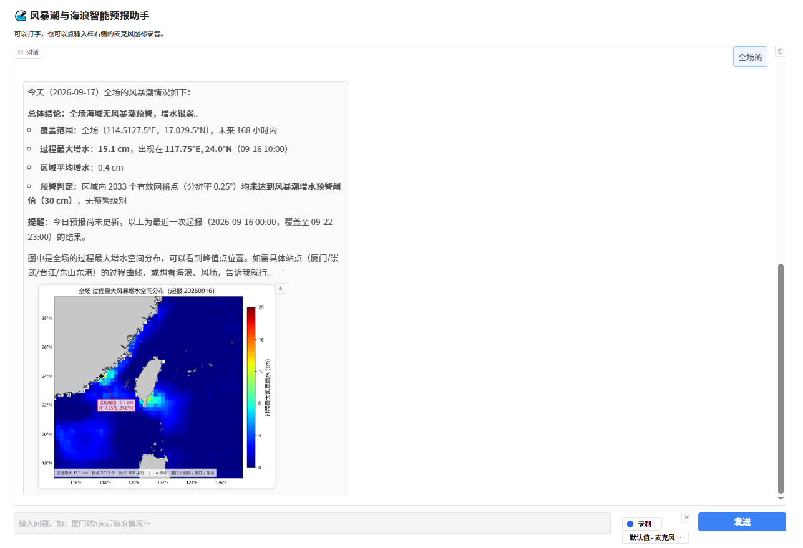

### 5.2 站点预报：判级表 + 过程曲线

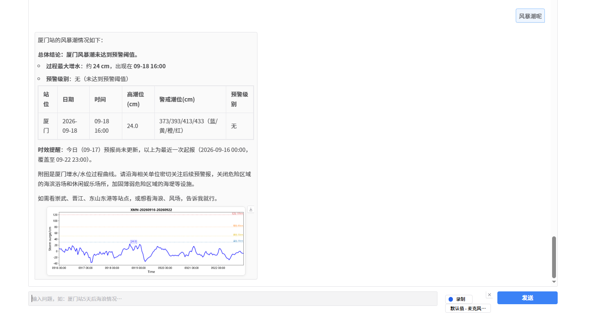

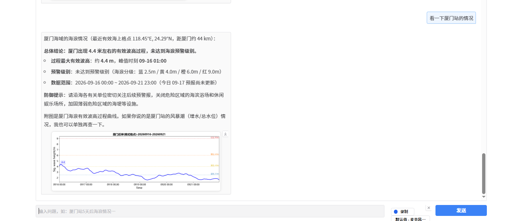

### 5.3 小区域精细场（0.01° 网格）

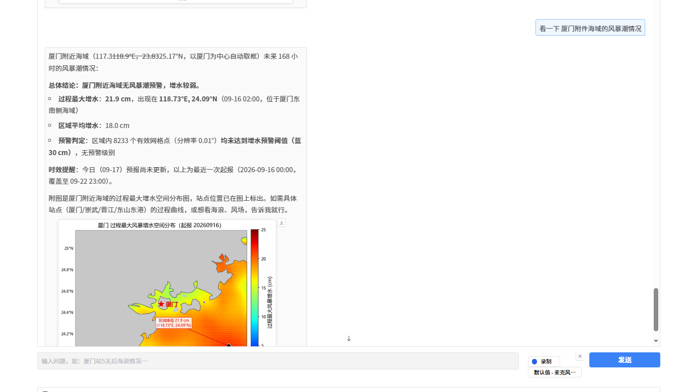

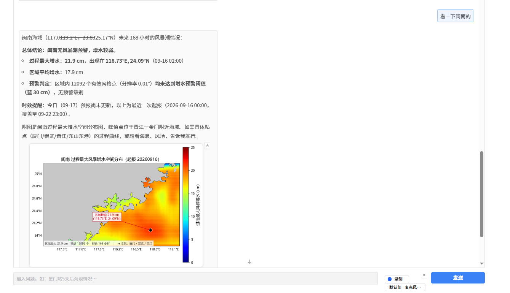

### 5.4 大范围全场（0.25° / 0.35° 网格）

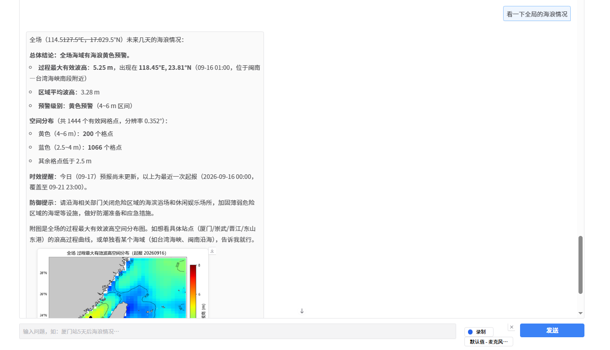

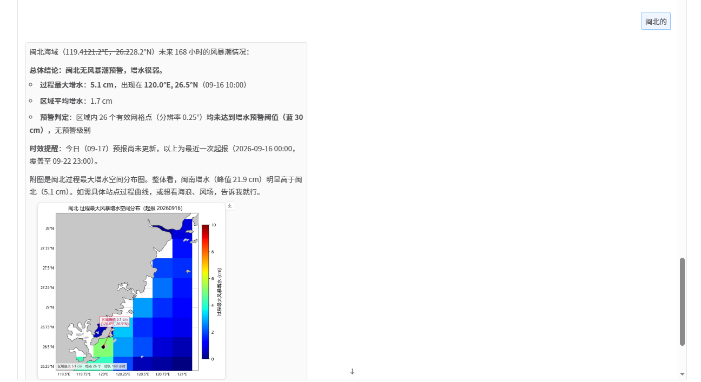

### 5.5 生成的原图（可直接用于业务）

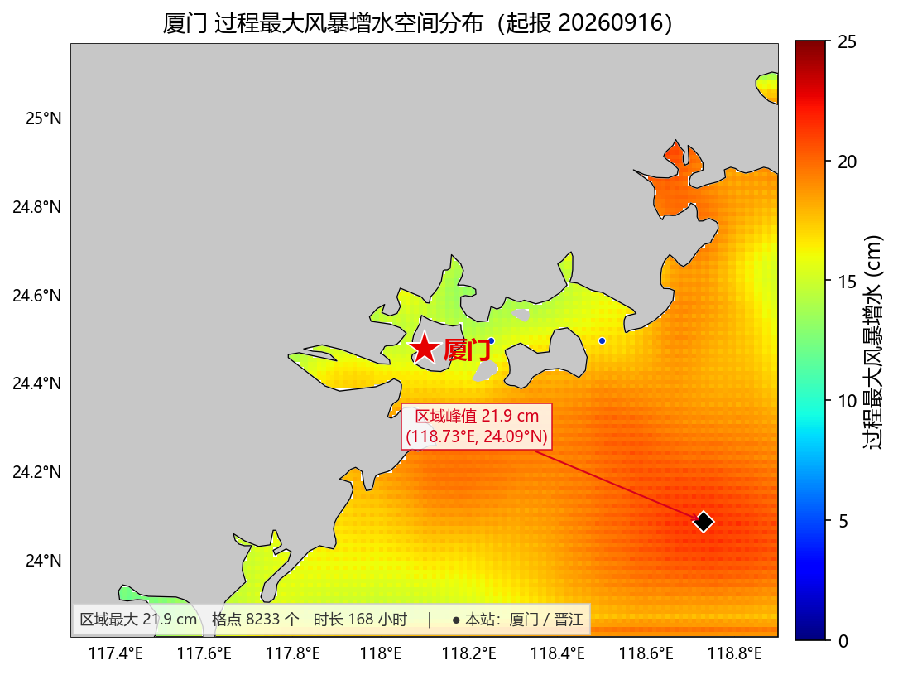

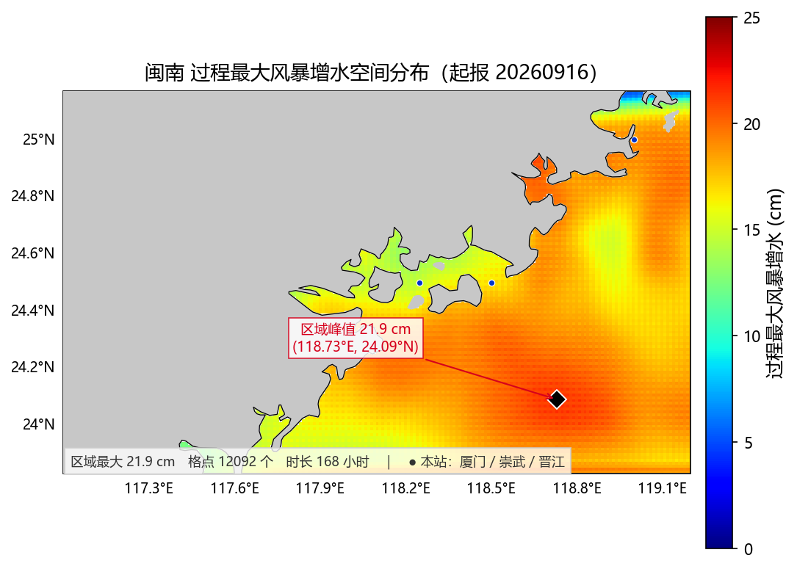

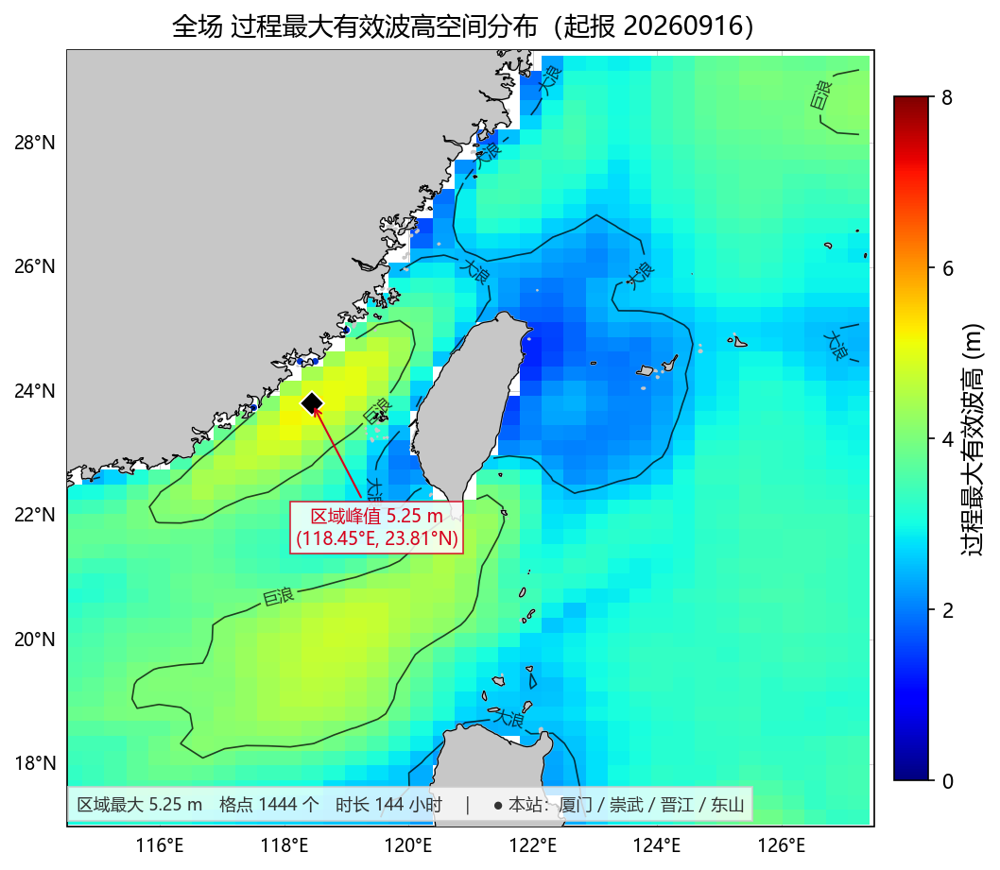

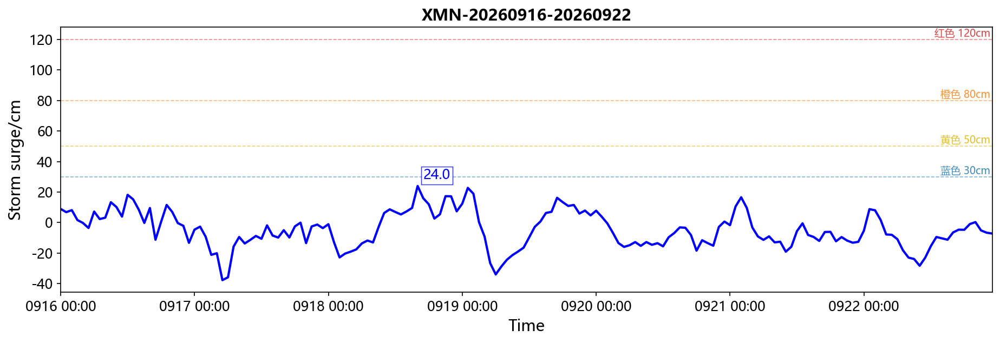

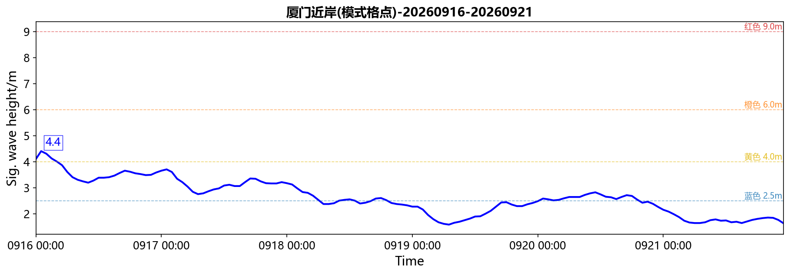

### 5.6 待补充的截图

| 【截图位置】需求澄清：问题说不清时，助手先问 3~5 个带选项的问题 |
| --- |
| （把截图粘贴到这里，粘贴后删除本行文字即可） |
|  |
|  |

| 【截图位置】自动生成的 Word 简报（红头文件版式） |
| --- |
| （把截图粘贴到这里） |
|  |
|  |

---

## 六、API 与配置

| 用途 | 服务 | 配置项 | 说明 |
| --- | --- | --- | --- |
| **对话大脑（必填）** | **DeepSeek** | `DEEPSEEK_API_KEY` | 模型 `deepseek-v4-pro`，接口 `https://api.deepseek.com`（OpenAI 兼容） |
| 语音识别（可选） | 腾讯云 ASR | `TENCENT_SECRET_ID` / `TENCENT_SECRET_KEY` | 不填则用**本地 faster-whisper** 离线识别兜底 |
| 数据源 | 课题组 FTP | `FTP_HOST` / `FTP_PORT` / `FTP_USER` / `FTP_PASS` | **只读**：仅列目录、看大小、下载 |

**API Key 已于 2026 年 9 月 17 日更换**，当前使用的 Key 为 `sk-88bb****976b`（35 位，完整值配置在项目根目录 `.env` 文件的 `DEEPSEEK_API_KEY` 一行，出于安全考虑不在本文档中写全）。

- 更换方法：编辑 `.env` 里 `DEEPSEEK_API_KEY=` 那一行 → 重启服务即可，无需改代码；
- 密钥安全：`.env` 已被 `.gitignore` 排除，**从未进入任何一次代码提交**（已核查提交历史）；
- 计费：按 DeepSeek 平台 token 计费，同一把 Key 的调用量合并计算；
- 网络：调用 DeepSeek 需**直连**（不要设 `HTTP_PROXY`，否则会连不上）。

---

## 七、怎么拿到代码 / 怎么部署

- 代码仓库（公开）：<https://github.com/jdhalaxi-123/agent-storms-urge-and-wave>
- 一键部署包：`deploy/` 目录内有 Windows 一键部署脚本（自动装 Python 环境、依赖、填 API Key、建桌面快捷方式）
- 每日数据自动下载：跑一次 `deploy/4-设置自动下载.bat`，注册计划任务后每 30 分钟检查一次，有新一期就自动下到 `stormdata/`

> 说明：本助手只做"数据接入 + 判级 + 出图 + 简报"，预报结果本身来自课题三/课题五的模型输出；最终判级以厦门中心业务化运行结果为准。
